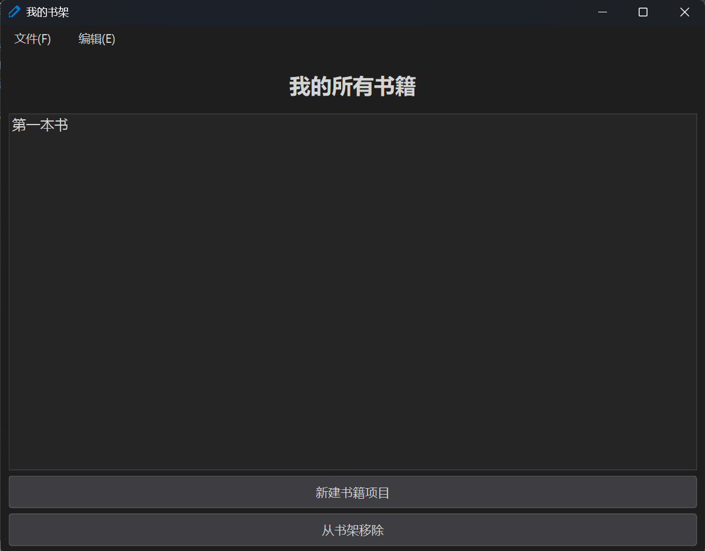
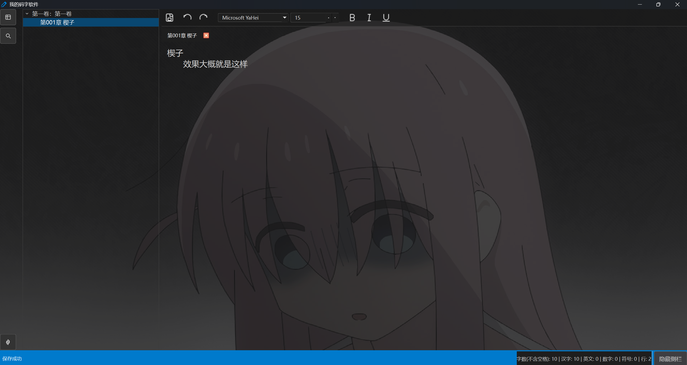

# Writer APP

> 轻量、专注、可自定义外观的本地小说 / 长文写作工具
<del>(瞎搞的)</del>

	
	

## ✨ 核心特性

1. 分卷 / 分章结构管理：体系列表 + 树形视图快速定位。
2. 章节删除规则：只能删除所在卷的最后一章，防止误删中间章节导致编号错乱。
3. 删除整卷智能合并：删除某卷时，其章节自动合并进第一个剩余卷，保证内容不丢失、顺序保持。
4. 双份内容存储：
	- chapters/：富文本（含格式标记）
	- plain_backup/：纯文本同步备份（应急恢复 / 版本对比）
5. 自动保存：定时 + 关键操作触发，降低写作风险。
6. 即时搜索高亮：章节内搜索使用 ExtraSelections，多匹配同步高亮，当前命中醒目显示。
7. 字体与排版可调：界面字体、编辑器字体、字号、行距百分比、回车缩进模式（保持/清除）均可配置。
8. 编辑区真实字号缩放：Ctrl + 鼠标滚轮进行字体级别缩放（非仅视图缩放）。
9. 背景自定义：选择任意本地图像 + 不透明度调节（营造沉浸感）。
10. 侧边栏折叠：状态栏按钮一键隐藏/显示项目导航。
11. 图标体系：统一 24×24 线性 SVG，支持运行时覆盖替换（自定义皮肤）。
12. 全局窗口图标：自动识别 icon.ico / icon.png / icon.svg。
13. 设置即时生效：修改快速设置面板中的参数立即反映到当前会话。
14. 稳健结构持久化：章节/卷的增删改操作即时写入 project.json，保证连续操作（例如 6→5→4 连续删）不出错。

## 🚀 快速开始

1. 安装依赖（需 Python 3.10+ 与 PyQt6）：
	- pip install PyQt6 (若项目未内置依赖管理)
2. 运行：
	- python main.py
3. 创建新书：通过界面新建，生成对应根目录：
	- project.json：结构与设置
	- chapters/ 存放章节内容文件
	- plain_backup/ 同步生成的纯文本备份
4. 开始写作：在左侧树新建卷 / 章，右侧编辑器输入内容，自动保存与手动保存并存。

## 🧭 功能操作要点

卷 / 章管理：
1. 新建卷后可在其下添加章节；章节按新增顺序编号。
2. 删除章节：仅允许删除该卷最后一章；若尝试删除中间章节会收到提示。
3. 删除卷：若该卷不是唯一卷，则其所有章节并入第一个剩余卷末尾后再删除；若是唯一卷且含章节，阻止删除以避免数据丢失。

搜索：
1. 章节内搜索支持上一条 / 下一条循环。
2. 所有命中以淡色高亮，当前命中强化边框或更深色。

字体缩放：
1. Ctrl + 鼠标滚轮放大/缩小编辑器字体。
2. 重置可在快速设置中直接调整基准字号。

背景：
1. 在设置中选择图片路径。
2. 调整不透明度 0~1（过低几乎不可见，过高易影响对比）。

## 🖼️ 自定义图标（覆盖机制）

1. 创建自定义目录（例如 icon_override/）。
2. 放入与内置同名的 svg：save.svg / undo.svg / redo.svg / bold.svg / italic.svg / underline.svg / find.svg / explorer.svg / search.svg / settings.svg。
3. 在 settings 中设置 icon_dir 为该目录名。
4. 重新启动或触发设置刷新后加载新图标。

建议：
- 画布 24×24，使用 1.5~2 px 线条居中对齐。
- 统一圆角与端点风格（round join, round cap）。

## ⌨️ 常用/计划快捷键（当前与规划）

| 功能 | 快捷键（计划/实现） |
| ---- | ------------------- |
| 保存 | Ctrl+S |
| 撤销 / 重做 | Ctrl+Z / Ctrl+Y |
| 查找 | Ctrl+F |
| 放大 / 缩小字体 | Ctrl + 滚轮 |
| 折叠侧边栏 | （按钮，计划添加快捷键） |
| 新建章节 | （计划：Ctrl+N 或对话） |

> 未列出的将来可扩展：全局替换、字数统计面板、进度热力图、导出 EPUB/Markdown。

## 🔄 数据安全策略

1. 自动保存定时器（短间隔写入）
2. 关键结构变动（增/删卷章）即时保存 project.json
3. 双轨文本（富文本 + 纯文本）冗余，降低文件破损风险
4. 推荐自行使用 Git / 云盘 做额外版本管理

## 🗺️ Roadmap（路线图）

- [ ] 可视化字数统计（按卷 / 章）
- [ ] 全局全文检索（跨章节）
- [ ] 章节拖拽排序（保持引用更新）
- [ ] 导出：纯文本 / Markdown / EPUB
- [ ] 自定义主题（暗 / 浅 / 自定义配色 JSON）
- [ ] 正文格式工具栏增强（标题级别 / 对齐 / 列表）
- [ ] 字数目标与进度提醒
- [ ] 冲突检测（多窗口编辑提示）

## 🛠️ 技术栈简述

- PyQt6 GUI（QMainWindow / QSplitter / QTextEdit）
- JSON 持久化（结构 + 设置）
- 自定义 SVG 图标加载（运行时可覆盖）
- ExtraSelections 搜索高亮实现

## 📄 License

本项目采用 MIT License 发布，详见仓库根目录 `LICENSE` 文件。

